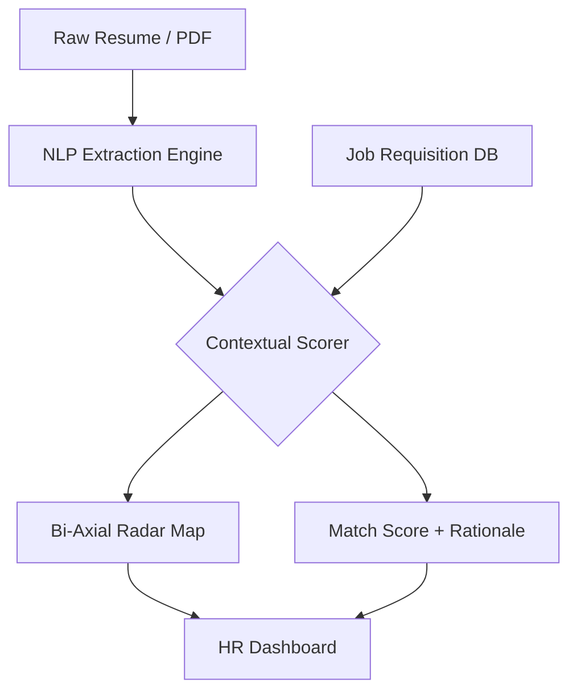

# Nova AI: Enterprise-Grade Resume Screening Engine


**Nova AI** is a professional-grade ATS (Applicant Tracking System) augment designed for high-velocity hiring teams. It leverages advanced NLP entity extraction to score and rank candidates against specific multi-job requisitions in real-time.

## 🚀 Key Features

- **Multi-Job Scoring Integration:** Seamlessly switch between active 'Job Reqs' and see candidate match-scores adjust dynamically based on requisition constraints.
- **Bi-Axial Skill Analytics:** Complex Radar mapping comparing candidate proficiency against industry benchmarks and target role requirements.
- **Streaming Vision Reasoning:** Simulates real-time LLM-driven rationale parsing to provide human-readable 'Decision Logic' for every candidate.
- **Awwwards-Tier UI:** Interactive cursor-spotlights, glassmorphic panels, and physics-based Framer Motion orchestration.
- **Command Power-Pallet:** (Cmd+K) instant search and navigation for high-productivity workflows.

## 🛠 Tech Stack

- **Core:** Next.js 16 (App Router), TypeScript 5, React 19.
- **Animations:** Framer Motion (Orchestration & Spring Physics).
- **Analytics:** Recharts (High-fidelity data viz).
- **Styling:** CSS Variables with HSL token system for modular themes.
- **State:** Persistent LocalStorage synchronization for offline-first resilience.

## 🏗 System Architecture



## 💻 Local Development

1. **Clone the Repo:**
   ```bash
   git clone https://github.com/Abhi3975/ai-resume-screener.git
   ```
2. **Install Dependencies:**
   ```bash
   npm install
   ```
3. **Run Dev Server:**
   ```bash
   npm run dev
   ```

## 📄 License
Distributed under the MIT License. See `LICENSE` for more information.
